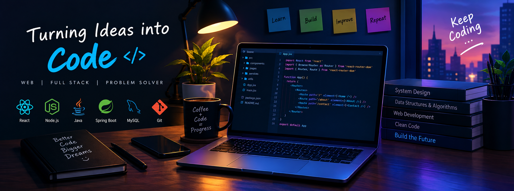

  

   

  

    

  

  

---

## 👩‍💻 About Me

- 🎓 B.Tech student at Bansal Institute of Engineering and Technology
- 💻 Passionate Software Developer and Full-Stack Developer
- 🧠 Strong interest in Data Structures & Algorithms
- 🤖 Exploring Artificial Intelligence and Machine Learning
- 🚀 Currently working on **AstroNav AI**
- 🧩 Solved **500+ problems on LeetCode**
- 📂 Maintained a GitHub portfolio with **35 repositories**
- 🌱 Always learning and building practical projects

---

## 💻 Technical Skills

### 👨‍💻 Programming Languages

### 🌐 Frontend Development

### ⚙️ Backend Development

### 🗄️ Databases & Tools

### 🤖 Artificial Intelligence

- Supervised Learning
- Unsupervised Learning
- Reinforcement Learning
- Deep Learning
- Agentic AI

---

## 🚀 Featured Projects

### 🌍 WonderTrust

A travel-based platform that helps users discover useful and popular places in different cities.

### 🍽️ QR Restaurant Scanner

A QR-based restaurant ordering system with:

- Digital menu
- Contactless ordering
- Real-time order tracking
- Owner dashboard

### 🎲 Dice Dare Ludo

An interactive multiplayer dice game developed using React, JavaScript, and CSS.

### 🌦️ Weather App

A React-based weather application that displays:

- Current temperature
- Minimum and maximum temperature
- Humidity
- Weather conditions

### 🛰️ AstroNav AI

An AI-based space navigation project exploring Reinforcement Learning for optimal path selection and satellite collision prevention.

### 🤖 Loan Prediction App

A machine learning application designed to predict loan approval based on user-provided information.

---

## 🧠 Problem Solving

  

    

  

---

## 🏆 Achievements

- 🏅 Participated in **SIH 2025–26 (Nagpur)**
- 💡 Solved **500+ LeetCode problems**
- 📁 Maintained **35 GitHub repositories**
- 🚀 Developed multiple software and AI projects

---

## 📊 GitHub Statistics

  

  

 

  

---

## 🐍 Contribution Animation

  

---

## 📫 Connect With Me

  

  

  

---

  ### 💙 Code Today, Create Tomorrow 🚀

  

